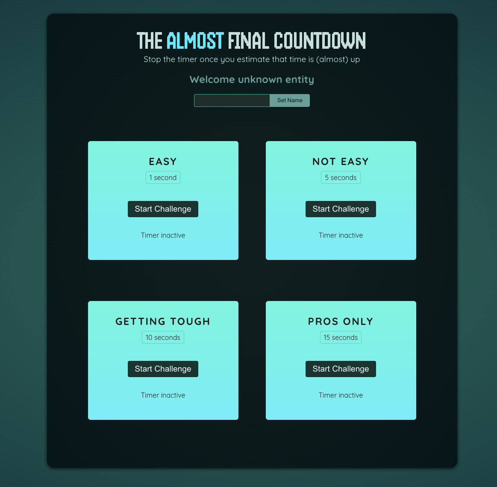

# countdown-game-app

## Description
This is a Countdown Game application based on the React - The Complete Guide 2025 (incl. Next.js, Redux) Udemy course by Maximilian Schwarzmüller. It is a practice project to show the use of Refs and Portals, and the use of React Hooks like useRef, useImperativeHandle, and functions from react-dom like createPortal.

## Technologies Used

* JavaScript
* HTML
* CSS
* Node.js
* React.js
* Git
* GitHub

## Contact Information

* GitHub Profile: [josevidmal](https://github.com/josevidmal)
* email: josevidmal@gmail.com

## Home Screen

